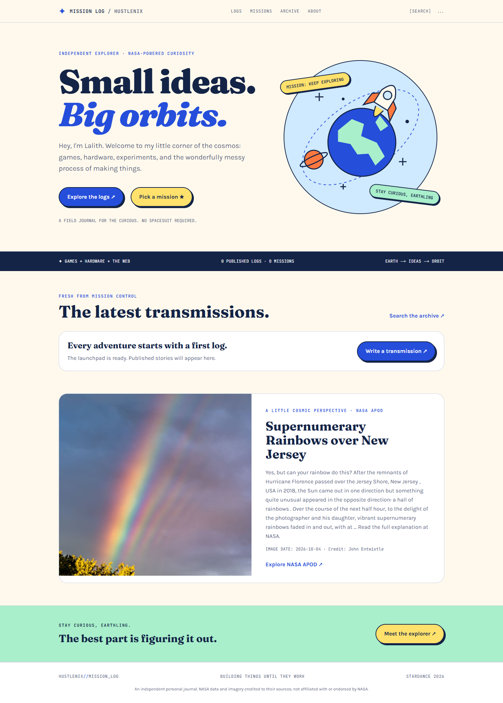

# Mission Log

Small ideas. Big orbits.

This is my personal build journal for games, hardware, websites, and whatever else I'm working on. A finished project doesn't tell the whole story, so the logs are a place for the experiments, broken bits, and changes along the way.

The space theme runs through the site: projects are missions, posts are transmissions, and the author dashboard is mission control. Bright colours, a little rocket, and actual NASA imagery. No spacesuit required.

**[Visit the blog](https://mission-log-omega.vercel.app/)**



## What's here

- Markdown posts, with drafts kept out of the public blog.
- An author dashboard for creating, editing, publishing, and deleting logs.
- Tags, project pages, reading times, and an archive search.
- Email/password accounts. Signing up doesn't give someone publishing access.
- NASA's Astronomy Picture of the Day on the homepage, with a date and image credit when supplied.
- Near-Earth Object data on article pages, using the post's publication date.
- Mobile navigation, article metadata, and a sitemap.

It's a personal blog, not a general-purpose CMS. The writing tools are intentionally small.

## Running it locally

You'll need Node.js 20.9 or newer, npm, and a MongoDB database. Atlas works, but a local MongoDB instance is fine too.

```sh
git clone https://github.com/Hustlenix/mission-log.git
cd mission-log
npm ci
```

Copy `.env.example` to `.env.local`. On PowerShell:

```powershell
Copy-Item .env.example .env.local
```

On macOS or Linux, use `cp .env.example .env.local` instead. Fill in these values:

| Variable | What to put in it |
| --- | --- |
| `MONGO_URI` | Your MongoDB connection string, including the database name. |
| `BETTER_AUTH_URL` | `http://localhost:3000` for local development. |
| `BETTER_AUTH_SECRET` | A long, randomly generated secret. Keep it private. |
| `NASA_API_KEY` | A key from [NASA's API portal](https://api.nasa.gov/). The API calls fall back to the rate-limited `DEMO_KEY` if this is blank. |
| `AUTHORIZED_AUTHOR_EMAILS` | The email addresses allowed to write logs, separated by commas. Use the same address as your author account. |

To generate an auth secret:

```sh
node -e "console.log(require('node:crypto').randomBytes(48).toString('base64url'))"
```

Then start the app:

```sh
npm run dev
```

Open [localhost:3000](http://localhost:3000). On a fresh database, create an account at `/signup` using an email from your author allowlist. Sign in and head to `/dashboard` to write the first log.

There's no need to run the seed script. A fresh database starts with no posts; the sample text in `seed.cjs` isn't a record of real project progress.

## A few useful places in the code

- `src/app/` — the public pages, dashboard, editor routes, and auth endpoint.
- `src/components/` — navigation, footer, and the edit form with Markdown preview.
- `src/lib/actions/posts.ts` — the publishing actions and server-side author checks.
- `src/lib/nasa.ts` — the NASA integrations and unavailable-data handling.
- `src/models/Post.ts` — the post schema.
- `src/app/globals.css` — colours, typography, and the shared visual styles.

The stack is Next.js 16, React 19, TypeScript, Tailwind CSS 4, MongoDB/Mongoose, and Better Auth. Markdown rendering uses `react-markdown` with `remark-gfm`.

## Deploying

The live site runs on Vercel. For your own deployment, connect the repository and add the same five environment variables to the production environment. Set `BETTER_AUTH_URL` to your actual deployed domain, not localhost, and redeploy after changing the variables.

Make sure your database's network access rules allow your hosting environment to connect. An `ENOTFOUND` error can also mean the cluster hostname is wrong or the cluster no longer exists, so check the connection string against Atlas before changing DNS settings.

Keep `.env.local` and any account-credential files out of Git. Environment variables belong in your local configuration or hosting dashboard, not in the README.

## Checks and rough edges

```sh
npm run lint
npm run build
```

There are no comments, reactions, image uploads, or RSS feed yet. Search is a literal, case-insensitive match rather than relevance-ranked search. Email verification and password-reset delivery aren't configured. The new-post project picker is currently a fixed list in `src/app/post/page.tsx`.

NASA services can be unavailable. The homepage prefers the current NASA Science APOD entry, with the API as a fallback; if neither works, it shows an unavailable message and a source link. The public-page reader may need updating if NASA changes its markup.

NASA data and imagery belong to their respective sources. This is an independent personal project, not a NASA-affiliated site.

Parts of the implementation and this documentation were developed with AI assistance.
