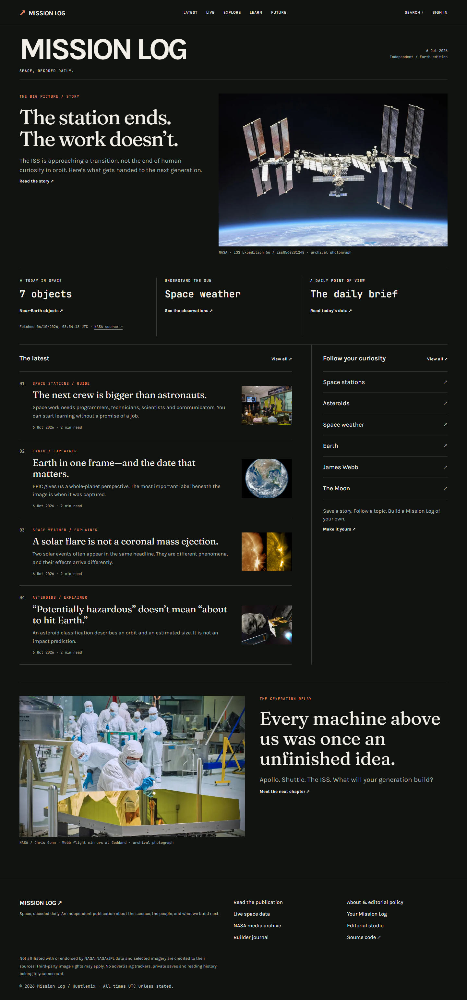

# Mission Log

Space, decoded daily.

Mission Log started as my build journal. It’s grown into an independent space publication: a place to read an explainer, check the NASA data behind it, and keep the things you want to come back to. The original project journal hasn’t gone away.

[Read Mission Log](https://mission-log-omega.vercel.app/)



## What you can do

Read source-linked stories and explainers, browse seven topic hubs, search the publication and NASA’s media archive, or inspect near-Earth approaches, space-weather observations and EPIC Earth imagery. The ISS and Generation pages connect the history to what comes next.

An account adds saved articles and images, topic follows, an asteroid watchlist and collections. Collections start private; sharing is a deliberate choice. Reading history is off until you enable it. The home feed uses topics you follow, rather than a mysterious recommendation score.

The editorial studio supports Markdown preview, sources, image credits, SEO fields, drafts, review, scheduling and publication. Authors work on their own drafts. Editors and admins control publication. Those rules are checked by server actions, not just hidden buttons.

This is a first public-publication release, not a completed newsroom or a careers marketplace. The [release notes](docs/publication-release.md) spell out the boundaries.

## Running it

Next.js 16, React 19, TypeScript, Tailwind 4, Better Auth and MongoDB/Mongoose. Tested with Node 24; Next requires Node 20.9 or newer.

```sh
git clone https://github.com/Hustlenix/mission-log.git
cd mission-log
npm ci
```

Copy `.env.example` to `.env.local`, then fill in:

| Variable                   | Purpose                                                                                                            |
| -------------------------- | ------------------------------------------------------------------------------------------------------------------ |
| `MONGO_URI`                | Database connection string, including the database name.                                                           |
| `BETTER_AUTH_URL`          | `http://localhost:3000` locally; your actual domain in production.                                                 |
| `BETTER_AUTH_SECRET`       | A long random secret. Never commit it.                                                                             |
| `NASA_API_KEY`             | Server-only key from [NASA](https://api.nasa.gov/). No silent demo-key fallback.                                   |
| `AUTHORIZED_AUTHOR_EMAILS` | Owner addresses eligible for explicit server-side provisioning. Signup alone does **not** grant publishing access. |

```sh
npm run dev
```

Create your owner account at `/signup`. To provision that existing account, put `AUTHOR_EMAIL` in a private `.env.author.local` file, then run:

```sh
node --env-file=.env.local --env-file=.env.author.local scripts/provision-owner.cjs --grant-admin
```

The script changes only that account’s server-managed role. It doesn’t mark the email verified or create an account. Reader signups remain readers. Never expose this script as a public endpoint.

The five starter explainers can be imported with:

```sh
node --env-file=.env.local scripts/import-publication.cjs
```

That import only inserts missing slugs; it doesn’t overwrite existing writing. Starter articles are disclosed as AI-assisted, source-guided explainers, not original reporting. Don’t run the old seed script to fabricate journal entries.

## The NASA part

`src/lib/nasa/` contains separate adapters for APOD, NeoWs, DONKI, EPIC and NASA media. APOD uses the current NASA Science WordPress endpoint. Cached records are normalized before storage; upstream API links and keys aren’t sent to the browser.

The cache lives in MongoDB, so it’s shared across Vercel instances. Refresh leases prevent multiple servers fetching the same cold feed. Expired records can be served with their original retrieval timestamp during an outage. Failures have a cooldown, and upstream refreshes have a fleet-wide hourly budget. If MongoDB itself is unavailable, the app doesn’t bypass the cache with an upstream request for every visitor.

These are observations, not safety alerts. “Potentially hazardous” isn’t an impact forecast. EPIC imagery shows its capture date and is not a live camera. Space weather is a catalogue, not an aurora prediction.

## Checks

```sh
npm test
npm run lint
npm run build
```

The regression suite executes real normalization, cache and server-action code with explicit database/session mocks. It covers cache leases and outages, publishing roles, ownership checks, unsafe URLs and history opt-in.

For browser acceptance, install Playwright separately or set `PLAYWRIGHT_MODULE` to an existing installation, start the app, and run `scripts/verify-publication.cjs`. `VERIFY_URL` selects the site (default `http://localhost:3002`). With `VERIFY_ACCOUNTS=1`, local database configuration and private owner credentials, it tests signup, saved items, collections, privacy and the publishing lifecycle. `VERIFY_EDITOR_FIXTURE=1` instead grants editor access only to a generated QA account for the CMS test; it does not verify the existing owner's password. It creates labeled temporary QA fixtures and removes only those fixtures. Screenshots and reports go into ignored `.vercel/qa-*` folders. Do not run it against a database you haven't authorized for testing.

## Deploying & limitations

The existing site uses Vercel. Set the same five server variables, use the deployed domain for `BETTER_AUTH_URL`, and redeploy after configuration changes. Database network rules must allow the host to connect. `ENOTFOUND` can also mean an incorrect or retired cluster hostname; check Atlas before assuming it’s your DNS.

Email verification and password-reset **delivery** are not connected. Neither are newsletters, push alerts, public comments, opportunity moderation, an automated editorial daily edition, or an advanced orbital simulator. The daily page is a clearly labeled data snapshot. Basic analytics count server renders and save/follow actions, including bots and testing; they are not unique-reader measurements.

The initial articles need human editorial review before paid promotion. Public-launch hardening still needs account deletion, working email recovery, a security review and production monitoring. Keep secrets out of Git, chat, screenshots and logs; rotate any credential that has been exposed.

Mission Log is not affiliated with or endorsed by NASA. Images have source credits; third-party rights may apply. Parts of the implementation, documentation and initial explainers were developed with AI assistance.
